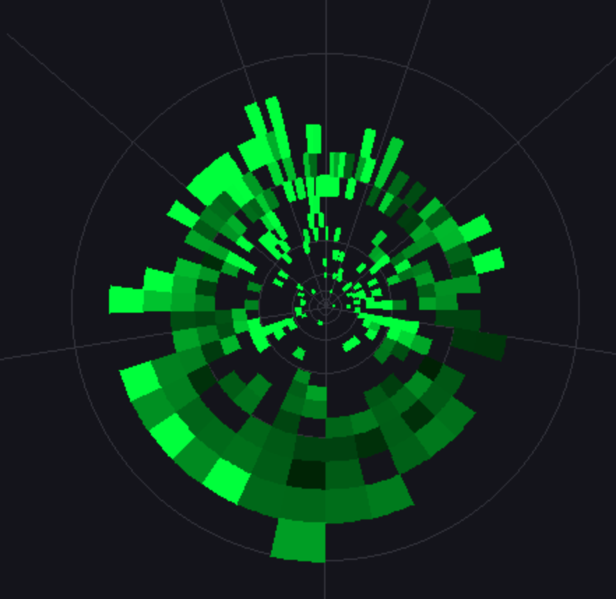

# Slither.io ESN Data Collector

A comprehensive system for collecting game state data from Slither.io using a polar logarithmic grid optimized for Echo State Network (ESN) training.

[](https://python.org)
[](https://developer.mozilla.org/en-US/docs/Web/JavaScript)
[](LICENSE)
[](https://github.com/NickP005/slitherio-scraper)

## Overview

This project implements a real-time data collection system for the browser game Slither.io, designed specifically for machine learning research with Echo State Networks. The system captures game state data using an advanced polar coordinate transformation that provides enhanced spatial resolution in the forward direction of the snake.

### System Components

1. **JavaScript Userscript** - Real-time data collection from browser
2. **Python Backend** - Data processing and storage server  
3. **PyGame Visualizer** - Real-time polar grid visualization

### Key Features

- **Polar Logarithmic Grid**: 64 angular × 24 radial bins with optimized spacing
- **Angular Warping**: Enhanced frontal resolution (α = 6.0) for better snake navigation
- **4-Channel Data**: Food, enemy bodies, own body segments, enemy heads
- **EMA Normalization**: Dynamic intensity adaptation for varying game conditions  
- **Zarr Storage**: High-performance format optimized for ML workflows
- **Real-time Processing**: 10Hz sampling rate with sub-100ms latency

### Alpha Parameter Deep Dive

The **alpha warping parameter** (α = 6.0) is crucial for optimizing spatial representation:

**Purpose**: The alpha parameter controls how angular space is redistributed to provide higher resolution in the forward direction of the snake, where most critical navigation decisions occur.

**Mathematical Effect**: 
```javascript
y = log(1 + α * x) / log(1 + α)
```
Where x is the normalized angular distance from forward direction [0,1].

**Practical Impact**:
- **α = 1.0**: Uniform angular distribution (no warping)
- **α = 6.0**: Moderate frontal enhancement - 40% more bins in front 90° arc
- **α = 20.0**: Extreme frontal focus - 70% of bins in front 90° arc

**Why α = 6.0**: This value provides optimal balance between:
- **Frontal Precision**: Enhanced resolution for obstacle detection and navigation
- **Peripheral Awareness**: Sufficient coverage for threats from sides and rear
- **Computational Efficiency**: Maintains manageable input dimensionality for ESN training

**Biological Inspiration**: Mimics how biological vision systems allocate more neural resources to foveal (central) vision while maintaining peripheral awareness.

## Polar Grid Mathematics


*Example: Polar logarithmic grid with angular warping (α = 6.0) visualized. Frontal bins are denser, providing higher spatial resolution in the snake's forward direction.*

### Coordinate Transformation
The system converts Cartesian coordinates (u, v) to polar coordinates (r, φ) and applies specialized transformations to optimize spatial distribution:

```javascript
// Logarithmic radius mapping
const logFactor = Math.log(r / rmin) / Math.log(rmax / rmin);
const j = Math.floor(M * logFactor);  // Radial bin

// Angular warping for frontal enhancement  
const warpedPhi = angularWarp(phi, alpha);
const theta = (warpedPhi + Math.PI) / (2 * Math.PI);
const k = Math.floor(K * theta);  // Angular bin
```

### Angular Warping Function
The angular warping concentrates more bins in the snake's forward direction:

```javascript
function angularWarp(phi, alpha) {
    const sign = Math.sign(phi);
    const x = Math.abs(phi) / Math.PI;
    const y = Math.log1p(alpha * x) / Math.log1p(alpha);
    return sign * y * Math.PI;
}
```

This transformation provides:
- **Enhanced frontal resolution** for better obstacle detection
- **Smooth interpolation** between angular bins
- **Preserved spatial relationships** in polar space

## Installation & Setup

### Prerequisites
- Python 3.7 or higher
- Modern web browser with Tampermonkey extension
- Internet connection for accessing Slither.io

### Quick Setup
```bash
# Clone the repository
git clone https://github.com/NickP005/slitherio-scraper.git
cd slitherio-scraper

# Run automated setup
chmod +x setup.sh
./setup.sh
```

### Manual Installation

1. **Install Python Dependencies**:
```bash
# Backend server dependencies
cd backend && pip install -r requirements.txt

# Visualizer dependencies  
cd .. && pip install -r visualizer_requirements.txt
```

2. **Install Browser Userscript**:
   - Install [Tampermonkey extension](https://tampermonkey.net/)
   - Open `slither-data-collector.user.js`
   - Copy the entire script content
   - Create new userscript in Tampermonkey
   - Paste code and save

3. **Verify Installation**:
```bash
# Test backend server
cd backend && python run_server.py

# In another terminal, test visualizer
cd .. && python visualizer.py
```

## Usage Guide

### Quick Start

**Option A - Backend Only**:
```bash
./start_server.sh
```

**Option B - Backend + Real-time Visualizer**:
```bash
./start_with_visualizer.sh
```

### Manual Startup

1. **Start the Backend Server**:
```bash
cd backend && python run_server.py
```
Server starts on `http://127.0.0.1:5055`

2. **Launch Real-time Visualizer** (optional):
```bash
python visualizer.py
```

3. **Begin Data Collection**:
   - Navigate to [slither.io](https://slither.io)
   - Start playing - data collection begins automatically
   - Monitor real-time data in visualizer

### Visualizer Controls

| Key | Action |
|-----|--------|
| `1` | View Food channel |
| `2` | View Enemy Bodies channel |
| `3` | View Own Body channel |
| `4` | View Enemy Heads channel |
| `ESC` | Exit visualizer |

## Data Structure

### Polar Grid Specification
- **Dimensions**: 64 angles × 24 radii × 4 channels = 6,144 values per frame
- **Radial Range**: 60-3,200 game units with logarithmic scaling
- **Angular Resolution**: Enhanced frontal precision via warping
- **Sampling Rate**: 10 Hz with adaptive buffering

### Channel Definitions
| Channel | Description | Weight Factor |
|---------|-------------|---------------|
| 0 | **Food** | Size-based (0.1 × food.size) |
| 1 | **Enemy Bodies** | Scale-based (0.3 × snake.scale) |
| 2 | **Own Body** | Scale-based (0.3 × snake.scale) |
| 3 | **Enemy Heads** | Enhanced (0.6 × snake.scale) |

### Frame Data Format
```json
{
  "timestamp": 1234567890.123,
  "sessionId": "1759256841627", 
  "frameIndex": 42,
  "deltaTime": 0.1,
  "grid": [6144],
  "gridMeta": {
    "angularBins": 64,
    "radialBins": 24,
    "channels": 4,
    "rMin": 60,
    "rMax": 3200,
    "alphaWarp": 6.0
  },
  "metadata": {
    "heading": 1.23,
    "headingSin": 0.94,
    "headingCos": 0.34,
    "velocity": 45.6,
    "boost": false,
    "distanceToBorder": 1200,
    "gameRadius": 21600,
    "snakeLength": 15
  },
  "playerInput": {
    "mx": 0.1,    // Mouse X component [-1, 1]
    "my": -0.2,   // Mouse Y component [-1, 1]  
    "boost": 0    // Boost state [0, 1]
  },
  "validation": {
    "hasSnake": true,
    "hasGlobals": true,
    "hasWebSocket": true,
    "hasInput": true
  },
  "debug": {
    "foodCount": 439,
    "enemySegments": 1205,
    "mySegments": 15,
    "enemyHeads": 4
  }
}
```

## Data Storage

Data is automatically saved in the `backend/data/` directory with organized structure:

```
backend/data/
└── session_1759256841627/
    ├── grids/              # Polar grids [frames, 64, 24, 4]
    ├── timestamps/         # Timestamps [frames] 
    ├── headings/          # Snake directions [frames]
    ├── velocities/        # Snake velocities [frames]
    ├── distances_to_border/ # Border distances [frames]
    ├── boost_states/      # Boost states [frames]
    └── player_inputs/     # Player inputs [frames, 3]
```

### Zarr Format Benefits
- **High Performance**: Optimized for ML workflows
- **Compression**: Blosc with lz4 codec  
- **Chunking**: 512 frames per chunk for efficient access
- **Metadata**: Complete configuration and statistics included
- **Scalability**: Handles datasets from MB to TB scale

## API Reference

The backend server exposes RESTful endpoints:

| Endpoint | Method | Description |
|----------|--------|-------------|
| `/ingest` | POST | Receive data from userscript |
| `/latest` | GET | Latest frame for real-time visualization |
| `/sessions` | GET | List active sessions |
| `/sessions/{id}/stats` | GET | Detailed session statistics |
| `/sessions/{id}/flush` | POST | Force buffer flush |
| `/health` | GET | Server health check |

### Example API Usage
```bash
# Get latest data for visualization
curl http://127.0.0.1:5055/latest

# Check server health
curl http://127.0.0.1:5055/health

# Get session statistics  
curl http://127.0.0.1:5055/sessions
```

## Configuration

### Userscript Configuration
Modify the `CONFIG` object in `slither-data-collector.user.js`:

```javascript
const CONFIG = {
    // Grid parameters
    ANGULAR_BINS: 64,        // Angular resolution
    RADIAL_BINS: 24,         // Radial resolution  
    ALPHA_WARP: 6.0,         // Frontal enhancement factor
    R_MIN: 60,               // Minimum radius (game units)
    R_MAX: 3200,             // Maximum radius (game units)
    
    // Sampling parameters
    SAMPLE_RATE_HZ: 10,      // Data collection frequency
    
    // Normalization parameters
    EMA_BETA: 0.99,          // EMA smoothing factor
    SATURATION_FACTOR: 3.0,  // Saturation clipping
    
    // Network
    BACKEND_URL: 'http://127.0.0.1:5055/ingest'
};
```

### Backend Configuration
Adjust settings in `backend/data_collector_server.py`:

```python
CONFIG = {
    'HOST': '127.0.0.1',
    'PORT': 5055,
    'CHUNK_SIZE': 512,               # Zarr chunk size
    'BUFFER_SIZE': 200,              # Frames before flush
    'MAX_SESSION_GAP_SECONDS': 30,   # Session timeout
    'MAX_VELOCITY': 1000.0,          # Validation threshold
    'MIN_GAME_RADIUS': 10000,        # Min valid game size
    'MAX_GAME_RADIUS': 50000         # Max valid game size
}
```

## Troubleshooting

### Common Issues

**"Waiting for data from Slither.io"**
- Verify userscript is enabled in Tampermonkey
- Ensure backend server is running on port 5055  
- Confirm you're on slither.io and actively playing
- Check browser console for JavaScript errors

**"Backend request error"**
- Confirm backend server is started (`python run_server.py`)
- Verify port 5055 is available and not blocked
- Check server logs for detailed error messages
- Test API endpoint: `curl http://127.0.0.1:5055/health`

**"Error populating grid"**
- Normal during initial game loading
- If persistent, check browser console for userscript errors
- Verify game objects are properly loaded

### Debug Information

**Browser Console Logs**:
```javascript
// All userscript logs are prefixed with [SLITHER-ESN]
// Monitor for:
// - WebSocket connection status
// - Frame processing statistics  
// - Data transmission confirmations
// - Error details and stack traces
```

**Backend Server Logs**:
```bash
# Server provides detailed information on:
# - Incoming data requests
# - Data validation results
# - Buffer flush operations  
# - Session management
# - Performance metrics
```

**Visualizer Statistics**:
- Real-time frame count and processing rate
- Data quality indicators
- Channel-specific object counts
- Network connectivity status

## Performance Optimization

### Recommended Settings
- **Game Performance**: Use medium graphics settings for stable framerate
- **Network**: Stable internet connection for consistent data transmission
- **System**: 4GB+ RAM recommended for extended data collection sessions

### Data Collection Tips
- **Session Length**: 5-15 minute sessions provide good balance of data quality and quantity
- **Game Strategy**: Focus on areas with multiple snakes and food for richer datasets
- **Consistency**: Maintain steady gameplay for training data uniformity

## Research Applications

### Echo State Network Training
The polar grid representation is specifically designed for ESN architectures:

- **Structured Input**: Consistent spatial representation across frames
- **Temporal Dynamics**: Sequential frame data captures game state evolution
- **Dimensionality**: 6,144 inputs per frame manageable for reservoir computing
- **Supervision**: Player inputs provide clear learning targets

### Potential Research Directions
- **Behavioral Modeling**: Learn human playing strategies and decision patterns
- **Real-time Prediction**: Predict player actions from environmental state
- **Comparative Analysis**: Study different players' strategies and performance
- **Transfer Learning**: Apply learned behaviors to other similar games

## Contributing

We welcome contributions! Please see our contributing guidelines:

1. **Fork** the repository
2. **Create** a feature branch (`git checkout -b feature/amazing-feature`)
3. **Commit** your changes (`git commit -m 'Add amazing feature'`)
4. **Push** to the branch (`git push origin feature/amazing-feature`)
5. **Open** a Pull Request

### Development Setup
```bash
# Install development dependencies
pip install -r requirements-dev.txt

# Run tests
python -m pytest tests/

# Code formatting
black src/
flake8 src/
```

## Citation

If you use this project in your research, please cite:

```bibtex
@software{slither_esn_collector,
  title={Slither.io ESN Data Collector},
  author={Niccolò Pagano},
  year={2025},
  url={https://github.com/NickP005/slitherio-scraper},
  note={Real-time data collection system for Echo State Network training}
}
```

## License

This project is licensed under the GNU General Public License v3.0 - see the [LICENSE](LICENSE) file for details.

This ensures that any derivative works or commercial usage must also be open-sourced under the same license terms.

## Acknowledgments

- **Slither.io** team for creating an engaging game environment
- **Echo State Network** research community for theoretical foundations  
- **Open Source** community for tools and libraries that made this possible

## Disclaimer

This tool is intended for educational and research purposes only. Please respect the terms of service of online games and use this tool responsibly. The authors are not responsible for any misuse of this software.

# Support & Community

Join our communities for support and discussions:

<div align="center">

[](https://discord.gg/Q5jM8HJhNT)

</div>

- **NickP005 Development Server**: Technical support and development discussions

---

**Ready to collect data? Start with `./setup.sh` and begin your ESN research journey!**